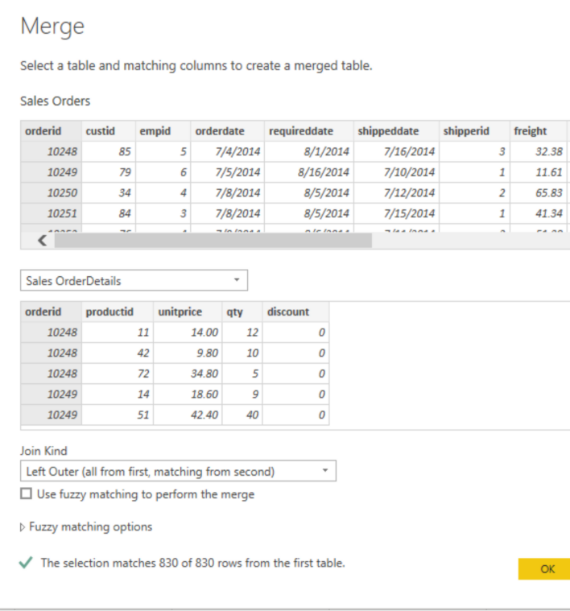
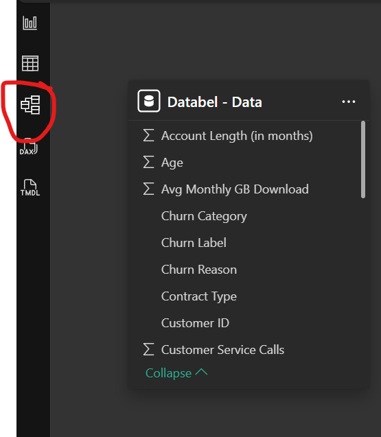

# Clean, Transform and load data in Power BI

## Shape the initial data
### Users can perform numerous data transformation tasks such as:
    - Removing or reordering columns.
    - Filtering rows.
    - Changing data types.
    - Splitting or merging columns.
    - Promoting first rows to headers.
    - Handling null values.
    - Performing aggregations like Group By.
    - Pivoting and unpivoting data.
### Steps in transforming data
    1. Identify column headers and names
        - promote headers
            
    2. Rename columns 
        - right click the header -> rename
        - or double click header and overwrite
    3. Remove top rows
        - 
    4. Remove unneeded columns
        - select unwanted columns -> 'Remove Columns' on home tab
            - 
        - or select wanted columns -> 'Remove Other Columns' on home tab
            - 
    5. Unpivot columns
        - turns columns to rows, or wide-format to long-format
        - select cloumns to be unpivoted -> Transform Tab -> Unpivot
        - rename columns if necessary
    6. Pivot columns
        - turns rows into columns of aggregated values
        - select column to be pivoted -> Transform Tab -> Pivot Column
        - Select the 'Values Column' and 'Aggregate Value Function' 
            - 
## Simplify the data structure
    - rename querires and views to meaningful names
        - views are prefixed with 'v' ex. vProduct
    - replace values
        - 
        - 
    - replace null values
        - use steps from above
        - 
    - remove duplicates
        - consider copying table before
        - right click -> 'Remove Duplicates'
    - Best Practice for naming tables, columns, and values
        - use language and abrreviations that are commonly used in your organization
        - replace '_' with spaces
        - be consistent with terminology
        - make it make sense
## Evaluate and change column data types
    - Incorrect data types prevent certain calculations, deriving hierarchies or cerating relationships with other tables.
        - calculation example: order dates being stored as text prevents YTD calculations
        - hierarchies example: order dates as text dont allow yearly, monthly, weekly hierarchies
    - Change the column data type
        - change in power query editor before loading data (best practice)
            - 
        - can also change selecting data type icon next to column header
            - 
## Combine multiple tables into a single table
### When to combine tables
    - too many tables exist makes the semantic model complicated
    - several tables have similar roles
    - a table only contains a column or two that can fit onto another table
    - you want to combine several columns from different tables into one custom column
### How to combine tables
    - Append queries
        - adds rows to tables or queries
            - ex. a contact list with Customers,Suppliers and Employees. 3 Tables with ['name', 'company', 'phone']
        - on Power Query Editor, Home tab -> Append Queries
    - Merge Queries
        - adds columns to tables that share a common column
            - similar to JOIN in SQL
            - ex. an 'orders' table and 'order details' table
        - on Power Query Editor, Home tab -> Merge Queries
        - 
        - Merge types:
            - **Left Outer**: displays all rows in the first table, and only matching rows in second
            - **Full Outer**: displays all rows from both tables
            - **Inner**: displays only matched rows between two tables
## Profile data in Power BI
### Examine data structures
    - Use the Model tab to view relationships
        - 
    - Use Column Distribution, Column Quality and Column Profile Options from the view tab INSIDE PQE.
        - 
## Use Advanced Editor to modify M code
 - Power BI uses M code to control queries
 - Advanced Editor is accessed on the view tab in PQE
 
    

